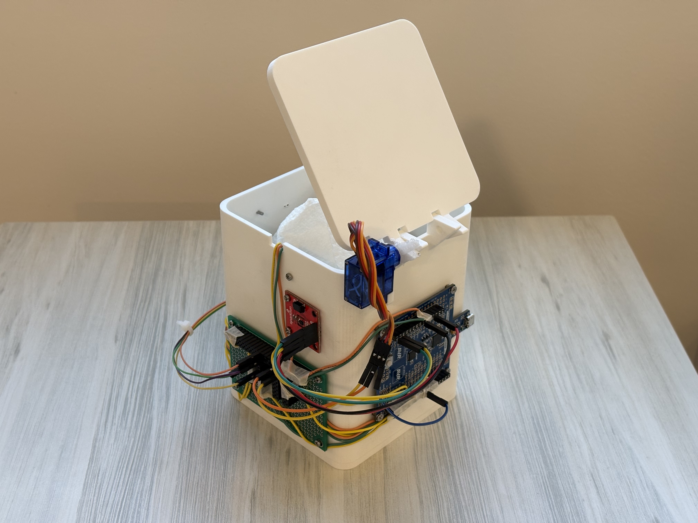

# ESE 5190 Final Project: Smart Trash Can

* Team Name: Embedded Mice
* Team Members: Sitong Li, Andy Xiao, Xinyuan Cui
* Github Repository URL: https://github.com/upenn-embedded/final-project-embedded-mice.git 
* Github Pages Website URL: https://andyxiao000github.io 
* Description of hardware: Ultrasonic range sensor, servo motor, infrared/ambient light range sensor, LCD display module, Atgema328PB mini.

## Final Project Report

### 1. Video

[Link to Video](https://youtu.be/atmALwS_LIU)

### 2. Images

<figure>
    
</figure>

<figure>
    
</figure>

### 3. Results 

### Software Requirements Specification (SRS)

#### 3.1 Overview
From a software perspective, this project implements an automated control system for a smart trash can, including distance detection triggering, garbage level monitoring, temperature display, and other functionalities. The system uses the ATmega328PB microcontroller to coordinate data collection from various sensor modules and control outputs, while displaying relevant information through an LCD screen.

#### 3.2 Users
The target users of this project include:

- Regular office/home users
- Desktop users needing convenient waste disposal solutions
- Users interested in smart home technology
- Users with special needs (e.g., mobility limitations)

#### 3.3 Definitions, Abbreviations

| Term | Definition |
|------|------------|
| LCD  | Liquid Crystal Display |
| IR   | Infrared |
| PWM  | Pulse Width Modulation |
| I2C  | Inter-Integrated Circuit |
| SRS  | Software Requirements Specification |
| UI   | User Interface |

#### 3.4 Functionality

##### SRS 01 - Distance Detection Function
- Ultrasonic sensor samples distance data every 100ms
- Triggers lid opening when distance is less than 25cm
- Automatically closes lid when distance remains greater than 25cm for 3 seconds

##### SRS 02 - Garbage Level Detection Function
- IR sensor checks garbage level status every 500ms
- Converts detection results to "EMPTY" or "FULL" status
- Updates LCD display in real-time

##### SRS 03 - Temperature Monitoring Function
- Temperature sensor reads ambient temperature every 1 second
- Temperature data accurate to one decimal place
- Displays temperature value on LCD in real-time

##### SRS 04 - LCD Display Function
- Controls LCD display through I2C communication protocol
- First line shows garbage level status (EMPTY/FULL)
- Second line shows current ambient temperature

##### SRS 05 - Servo Control Function
- Controls servo angle using PWM signals
- 90 degrees for open position, 0 degrees for closed position
- Ensures smooth and moderate-speed lid operation

These functional requirements ensure stable system operation and provide users with a convenient experience. Each function module has clear execution cycles and trigger conditions, guaranteeing timely and reliable system response.

### Hardware Requirements Specification (HRS)

#### 4.1 Overview
From a hardware perspective, this project builds a desktop smart trash can system that integrates multiple sensors and actuators. The system is based on the ATmega328PB microcontroller platform, incorporating ultrasonic distance sensing, IR level detection, temperature monitoring, LCD display, and servo motor control for automated operation.

#### 4.2 Definitions, Abbreviations

| Term  | Definition |
|-------|------------|
| MCU   | Microcontroller Unit |
| GPIO  | General Purpose Input/Output |
| VCC   | Voltage Common Collector (Power Supply) |
| GND   | Ground |
| PCB   | Printed Circuit Board |
| ADC   | Analog-to-Digital Converter |

#### 4.3 Functionality

##### HRS 01 - Core Processing Unit
- System shall be based on ATmega328PB microcontroller
- Operating voltage: 5V
- Clock frequency: 16MHz
- Minimum required I/O pins: 8 digital, 2 analog

##### HRS 02 - Distance Detection Module
- Ultrasonic sensor for user proximity detection
- Operating range: 2-25cm
- Power supply: 5V DC
- Response time: <10ms

##### HRS 03 - Garbage Level Detection
- IR sensor for garbage level monitoring
- Detection range: 0-20cm
- Operating voltage: 3.3V-5V
- Digital output interface

##### HRS 04 - Temperature Sensing
- Digital temperature sensor
- Measurement range: -10°C to 50°C
- Accuracy: ±0.5°C
- Operating voltage: 3.3V-5V

##### HRS 05 - Display Unit
- 16x2 LCD display with I2C interface
- Operating voltage: 5V
- Display area: Minimum 16 characters × 2 lines
- Backlight: Blue/White LED

##### HRS 06 - Actuator Control
- Micro servo motor for lid control
- Operating voltage: 5V
- Rotation range: 0-90 degrees
- Torque: Minimum 1.5kg/cm

##### HRS 07 - Power Requirements
- Input voltage: 5V DC
- Current consumption: < 500mA
- Power source: USB or DC adapter

These hardware specifications ensure all components are compatible and the system can perform its intended functions reliably and efficiently.

### 5. Conclusion

This project provided valuable insights into integrating hardware and software in an embedded system. We gained a deeper understanding of using peripherals like timers, interrupts, and communication protocols (UART) on the ATmega328PB microcontroller. It also reinforced the importance of modular code design, enabling easier debugging and scalability.

The ultrasonic sensor successfully measured distances, and the servo motor dynamically adjusted based on those measurements. The system performed reliably in real-time. The modular structure of the code (separating sensor, servo, and communication logic) ensured clear responsibilities for each part, simplifying testing and troubleshooting. Using PlatformIO streamlined the development process, from compiling to debugging, making the workflow efficient.

Combining multiple subsystems (sensor, actuator, UART) into a cohesive and functional system. The system responded quickly to changes in the environment, demonstrating effective real-time control. Leveraging PlatformIO's debugging tools, I was able to address issues systematically, ensuring robust functionality.

What Could Have Been Done Differently: A more compact and shielded layout could have reduced signal noise and interference between components; Adding low-power modes and more efficient power regulation could have improved the system's energy efficiency; Simulating different environmental conditions, such as noisy signals or varying object reflectivity, could have made the system more robust.

Unexpected Obstacles: High-frequency noise occasionally interfered with ultrasonic sensor readings, requiring additional filtering; Fine-tuning the PWM frequency and ultrasonic signal timing took longer than anticipated due to hardware constraints.

Next Steps for This Project:

1. Integrate additional sensors (e.g., infrared or laser) to enhance measurement accuracy and support diverse applications. Add a display to visualize distance data locally.
2. Introduce power-saving modes for both the microcontroller and peripherals to optimize battery usage.
3. Implement Bluetooth or Wi-Fi modules for remote monitoring and control, enabling IoT applications.
4. Test the system under varied environmental conditions, including outdoor settings, to ensure reliability.
5. Incorporate filtering for smoother measurements and servo control logic for finer adjustments.